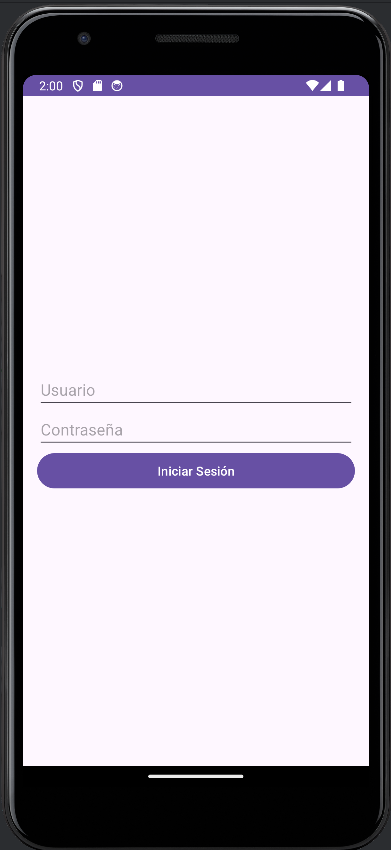

# app-validation-user
ProyectoLogin es una aplicación Android que implementa un sistema de autenticación básico, demostrando el uso de múltiples Activities y la transferencia de datos entre ellas. Esta aplicación es ideal para principiantes en desarrollo Android que desean aprender sobre:

# Creación y manejo de múltiples Activities.
 Implementación de un sistema de login simple.
 Uso de Intents para navegar entre Activities y pasar datos.
 Manejo de controles de interfaz de usuario como EditText, Button y TextView.
 Uso de Toast para mostrar mensajes de error.

# Características principales:

 Pantalla de inicio de sesión con campos para usuario y contraseña.
 Validación de contraseña contra una clave predefinida ("tuxito123").
 Navegación a una segunda Activity en caso de autenticación exitosa.
 Mensaje de bienvenida personalizado en la segunda Activity.
 Manejo de errores mediante Toast para intentos de login fallidos.

 # vista del imagen
 
